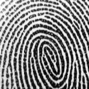

## Fingerprint and Finger-vein fusion recognition

The code for the paper **Robust Graph Fusion and Recognition Framework for Fingerprint and Finger-vein**

#### Requirements

- python 3.7
- pytorch 1.9.1
- torch-geometric 2.0.1
- scipy 1.7.1

#### Testing a Model

We provide a pretrained model `"model/model_dict.pth"` and a small set of test samples `data/FP_200sp_test_c2.00.pkl` and `data\FV_200sp_test_c2.00.pkl`

Run a test script `python3 main.py --train False`

#### Training a Model

Run a test script `python3 main.py --train True`

#### Data samples

                      

